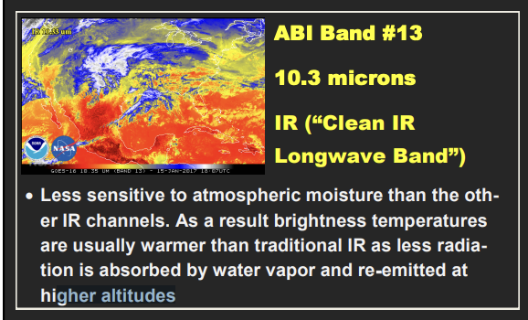
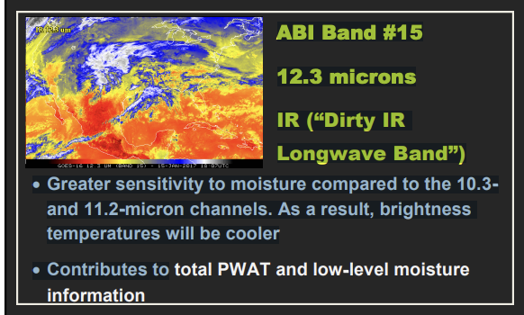

# Contrail Net
### Neural Network Models: Contrail Detection & Segmentation from Satellite Images

[Fork from @junzis| contrail-net](https://github.com/junzis/contrail-net)

Contrail Net leverages a pre-trained ResUNet model, image augmentations, and SR Loss using Hough space. Demonstrates contrail detection with various models, loss functions, and image sources. Built with PyTorch and includes a visualization notebook.

## Advancements:
- **Augmented Transfer Learning**: Image transformations on pre-trained ResUNet for diverse contrail scenarios.
- **SR Loss**: Merges segmentation and optimization using Hough space.
- **Model & Loss Function Examples**: Contrail detection with ResUNet, Dice Loss, Focal Loss.
- **Image Source Examples**: Contrail detection from GOES-16, Himawari-8, MODIS.

## Image Sources:
Uses GOES-16 channels 13 (10.35 µm) and 15 (12.3 µm) to generate brightness temperature difference (BTD) images, isolating optically thin cirrus clouds and contrails.

*ABI Band 13 - 10.3 µms - "Clean" Longwave Window*
  
*ABI Band 14 - 11.2 µms - Longwave Window*

*ABI Band 15 - 12.3 µms - "Dirty" Longwave Window - Water Vapor Absorption*

## References:
- [Flight Contrail Segmentation with SR Loss in Hough Space](https://arxiv.org/pdf/2307.12032.pdf)
- [ABI Band 13 - 10.3 µms](http://cimss.ssec.wisc.edu/goes/OCLOFactSheetPDFs/ABIQuickGuide_Band13.pdf)
- [Split Window Difference](http://cimss.ssec.wisc.edu/goes/OCLOFactSheetPDFs/ABIQuickGuide_SplitWindowDifference.pdf)

## Data Augmentation:
1. **Random Transformations**: Applied to original image and contrail mask.
2. **Padding/Cropping**: Transformed image and mask adjusted to a consistent pixel size (multiple of 32 pixels).
3. **Brightness & Contrast Adjustments**: Random changes to padded image; mask remains unchanged.

## Split Window Difference (SWD):
Brightness temperature difference field highlighting low-level moisture and dust. Calculated by subtracting the 12.3 µm channel from the 10.3 µm channel. Identifies moisture gradients and detects atmospheric moistening, influencing convection and precipitation. Limitations include susceptibility to temperature or water vapor changes and reduced post-sunrise effectiveness.

---

# Feature Engineering Ideas for Contrail Detection

## Dataset Adjustments:
- **Band Selection**:
  - For a simplified approach, modify the dataset class to read from `band_13` to `band_16` (4 bands).
  - Adjust the U-Net `in_channels` to 4 to match the number of bands used.
  - Switch to the aggregated ground truth masks (`human_pixel_masks.npy`) for training.

## Temporal Sequence Handling:
- Consider using a **Recurrent Neural Network (RNN)** or **LSTM layers** after feature extraction to capture temporal dependencies in the sequences.
- Explore **3D convolutions**, treating the temporal sequence as a depth dimension.
- Implement an **attention mechanism** to focus on specific frames in the sequence that might be more informative.

## Band Selection:
- Utilize domain knowledge or feature importance techniques to select the most informative bands for contrail detection.
- Experiment with different combinations of bands to determine the optimal performance.

## Augmentation Strategies:
- Given the temporal nature of the data, consider temporal augmentations such as:
  - Frame shuffling
  - Frame skipping
  - Frame reversing
- Apply traditional image augmentations:
  - Rotations
  - Flips
  - Brightness and contrast adjustments

## Incorporate Metadata:
- If additional metadata (e.g., time of day, weather conditions) is available, incorporate it as additional input features.

## Ensemble Models:
- Train multiple models with varying architectures or on different bands.
- Use ensemble techniques, such as stacking or majority voting, for the final prediction.

## Attention Mechanisms:
- Implement attention mechanisms to focus on specific regions in the image sequence, especially since contrails should be visible in at least two images.

## Use Pre-trained Models:
- Fine-tune pre-trained models for contrail detection.
- Leverage transfer learning, especially if the dataset size is limited.

## Contrail Net Advancements:
- **Augmented Transfer Learning**: Utilize image transformations on a pre-trained ResUNet model to adapt to various contrail scenarios.
- **SR Loss**: Introduce a new loss function that combines segmentation and optimization objectives using Hough space information.
- **Diverse Model Examples**: Showcase contrail detection using various models and loss functions, such as ResUNet, Dice Loss, and Focal Loss.
- **Diverse Image Sources**: Demonstrate contrail detection capabilities using different image sources like GOES-16, Himawari-8, and MODIS.

## Image Sources and Band Information:
- Utilize the brightness temperature difference (BTD) images, which can isolate the presence of optically thin cirrus clouds and contrails from background interference.
- Consider the significance of the "clean" infrared window band (band 13 covering 10.35 µm) and the "dirty" infrared window band (band 15 covering 12.3 µm) in contrail detection.
- Explore the potential of other infrared bands for BTD calculation.

## Split Window Difference (SWD):
- Understand the importance of SWD in highlighting low-level moisture and dust.
- Recognize the benefits of SWD in identifying moisture gradients and detecting atmospheric moistening, which can influence convection and precipitation.
- Be aware of the limitations of SWD, such as its susceptibility to temperature or water vapor changes and reduced effectiveness after sunrise.

---
